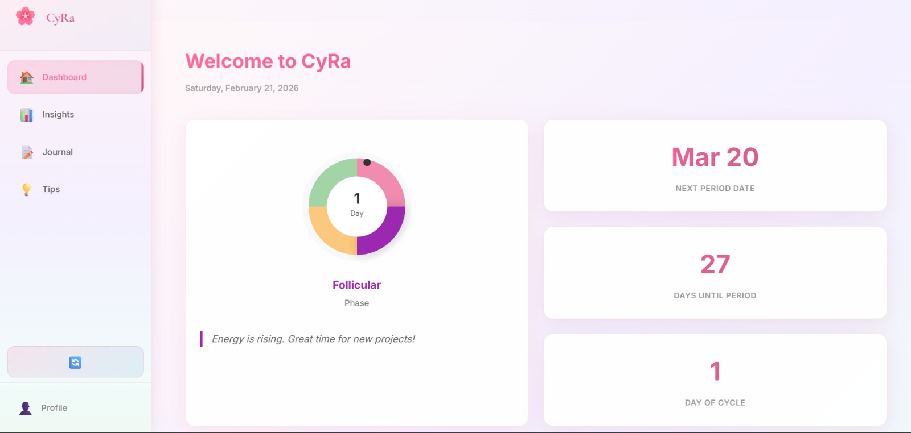
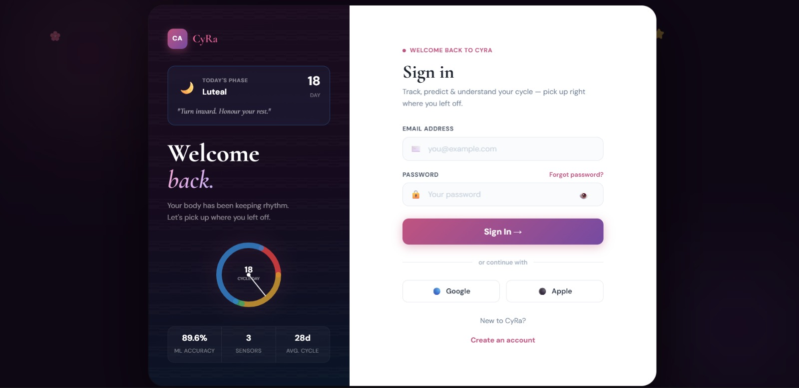
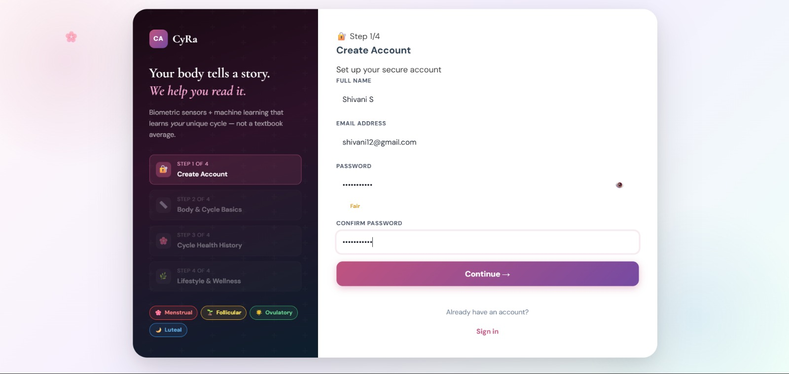
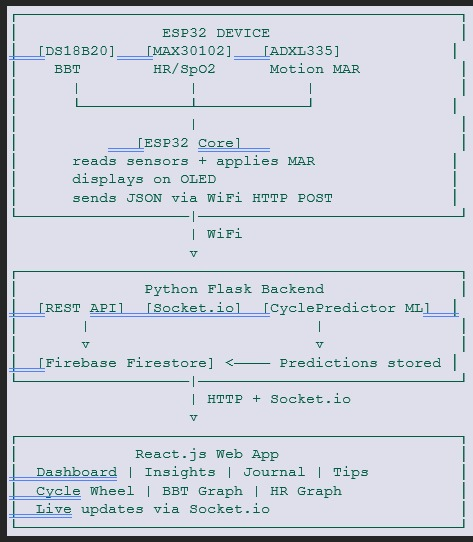

<p align="center">
</p>

# CyRa 🎯

## Basic Details

### Team Name: Debuggers

### Team Members
- Member 1: Laasya UG  - MITS
- Member 2: Shivani S Bhat - MITS


### Project Description
CycleAura is a smart wearable menstrual health tracking system that uses real-time biometric sensing and machine learning to monitor and predict a user’s menstrual cycle phases with high accuracy. Instead of manual input or calendar-based estimations, the system continuously collects physiological data such as basal body temperature, heart rate, and motion patterns using body-mounted sensors.

The wearable device transmits sensor data to a cloud-based backend, where a machine learning model analyses patterns to predict cycle phases, ovulation windows, and upcoming periods. Results appear on an interactive web dashboard that offers personalised health insights, symptom tracking, and phase-based wellness guidance.

By combining hardware sensing, data analytics, and personalised recommendations, CycleAura offers users a comprehensive and automated understanding of their reproductive health.CycleAura_ProjectPlan


### The Problem statement
Most existing menstrual tracking apps rely on calendar-based predictions and manual input, which ignore real physiological signals and lead to inaccurate results. This prevents users from receiving reliable ovulation predictions and personalised health insights. There is a need for an automated system that uses real biometric data to provide accurate, individualised cycle tracking.

### The Solution
CycleAura solves this problem by using a wearable device that continuously collects real biometric data such as basal body temperature, heart rate, and motion. This data is analysed using machine learning to accurately predict menstrual cycle phases, ovulation, and upcoming periods. The system then delivers personalised insights and health guidance through an interactive web dashboard.

---

## Technical Details

### Technologies/Components Used

**For Software:**
- Languages used: Arduino C++, Python, Javascript, HTML & CSS
- Frameworks used: Flask, React, MongoDB, Socket.io, scikit-learn
- Libraries used:
  - ### 🔹 Firmware (ESP32)
  - OneWire — communication with DS18B20 temperature sensor  
  - DallasTemperature — temperature data processing  
  - Wire (I2C) — communication with OLED and MAX30102  
  - Adafruit GFX — graphics support for OLED display  
  - Adafruit SSD1306 — OLED display control  
  - MAX30102 Sensor Library — heart rate and SpO2 readings  
  - WiFi — network connectivity  
  - HTTPClient — sending sensor data to backend  
  
  ### 🔹 Backend (Python)
  - Flask — REST API server  
  - pymongo — MongoDB database connection  
  - scikit-learn — machine learning model  
  - pandas — data processing and analysis  
  - flask-cors — cross-origin request handling  
  - python-socketio — real-time communication  
  
  ### 🔹 Frontend (React)
  - Axios — API requests  
  - Recharts — data visualization graphs  
  - socket.io-client — live sensor data updates
  
- Tools used: VS code, MongoDB Atlas

**For Hardware:**
- Main components: ESP-32 Dev Board V1, MAX30102 (Heart Rate monitor), ds18b20 (Temperature Sensor), ADXL335 (Accelometer)
- Specifications:
  | Component | Specification | Purpose |
  |---|---|---|
  | ESP32 | 240 MHz dual-core processor, WiFi enabled | Data processing and cloud communication |
  | DS18B20 | Digital temperature sensor, ±0.5°C accuracy | Basal body temperature tracking |
  | MAX30102 | Optical heart rate and SpO₂ sensor | Pulse and oxygen monitoring |
  | ADXL335 | 3-axis analog accelerometer | Motion artifact removal |

- Tools required:  Arduino IDE

---

## Features

List the key features of your project:
- Feature 1: Real-Time Biometric Tracking - Continuously monitors basal body temperature, heart rate, and motion using wearable sensors.
- Feature 2: AI-Based Cycle Prediction - Machine learning analyzes personal biometric patterns to predict cycle phases and ovulation accurately.
- Feature 3: Non-Invasive Wearable Design - Comfortable sensor-based device enables effortless daily health monitoring without manual input.
- Feature 4: Personalized Health Insights Dashboard - Interactive web app provides cycle predictions, symptom tracking, and phase-based wellness guidance.

---

## Implementation

### For Software:

#### Installation
```bash
pip install -r requirements.txt
```

#### Run
```bash
npm run dev
python app.py
```

### For Hardware:

#### Components Required
| Component | Specification | Purpose |
  |---|---|---|
  | ESP32 | 240 MHz dual-core processor, WiFi enabled | Data processing and cloud communication |
  | DS18B20 | Digital temperature sensor, ±0.5°C accuracy | Basal body temperature tracking |
  | MAX30102 | Optical heart rate and SpO₂ sensor | Pulse and oxygen monitoring |
  | ADXL335 | 3-axis analog accelerometer | Motion artifact removal |

#### Circuit Setup
1. **Connect DS18B20 Temperature Sensor**
   - VCC → 3.3V (ESP32)
   - GND → GND
   - DATA → GPIO 4 (ESP32)
   - Add a 4.7kΩ pull-up resistor between DATA and VCC

2. **Connect MAX30102 Heart Rate Sensor (I2C)**
   - VCC → 3.3V (ESP32)
   - GND → GND
   - SDA → GPIO 21 (ESP32)
   - SCL → GPIO 22 (ESP32)

3. **Connect ADXL335 Accelerometer**
   - VCC → 3.3V (ESP32)
   - GND → GND
   - X → GPIO 34 (ESP32, ADC)
   - Y → GPIO 35 (ESP32, ADC)
   - Z → GPIO 32 (ESP32, ADC)
4. **Power the ESP32**
   - Connect ESP32 to computer using USB cable.
5. **Upload Firmware**
   - Open Arduino IDE
   - Select ESP32 board and correct COM port
   - Upload firmware to start data collection

---

## Project Documentation

### For Software:

#### Screenshots 

![Screenshot1] : Dashboard
<p align="center">
</p>


![Screenshot2] : Signin
<p align="center">


![Screenshot3]: signup
<p align="center">


#### Diagrams

**System Architecture:**


<p align="center">


**Application Workflow:**

![Workflow]:


---

### For Hardware:

#### Schematic & Circuit
<p align="center">

![Schematic]


#### Build Photos:

![Components]
<p align="center">
 - ESP 32
<p align="center">
<p align="center">
<p align="center">
<p align="center">
<p align="center">


<p align="center">


<p align="center">


---

## Additional Documentation

### For Web Projects with Backend:

##### Endpoints

## 🔗 Backend API Endpoints

### Sensor Data

| Method | Endpoint | Payload / Response | Purpose |
|-------|---------|-------------------|--------|
| POST | /api/sensor/bbt | `{ bbt, timestamp }` | Receive basal body temperature reading from ESP32 |
| POST | /api/sensor/heartrate | `{ bpm, spo2, timestamp }` | Receive heart rate and SpO₂ data from ESP32 |

---

### Cycle Prediction & Health Data

| Method | Endpoint | Payload / Response | Purpose |
|-------|---------|-------------------|--------|
| GET | /api/cycle/prediction | Returns phase, confidence, ovulation date, next period | Get ML cycle prediction |
| GET | /api/cycle/history | Returns array of past BBT readings | BBT trend graph data |
| GET | /api/cycle/heartrate | Returns array of past BPM readings | Heart rate trend data |

---

### Journal & Insights

| Method | Endpoint | Payload / Response | Purpose |
|-------|---------|-------------------|--------|
| POST | /api/journal/entry | `{ mood, pain, flow, pms, energy, notes }` | Save journal entry |
| GET | /api/journal/entries | Returns list of journal entries | Retrieve journal history |
| GET | /api/tips/today | Returns tips for current phase | Provide personalized health tips |

---

### User Profile

| Method | Endpoint | Payload / Response | Purpose |
|-------|---------|-------------------|--------|
| POST | /api/user/profile | `{ age, bmi, pcos, birth_control }` | Save user profile |
| GET | /api/user/profile | Returns user profile object | Load profile for ML personalization |

---


### For Hardware Projects:

#### Bill of Materials (BOM)

| Component | Quantity | Specifications | Price (INR) | Link/Source |
|-----------|----------|----------------|-------------|-------------|
| ESP32 Development Board | 1 | WiFi-enabled microcontroller, 240 MHz dual-core | 400 | Local electronics store / online |
| DS18B20 Temperature Sensor | 1 | Digital temperature sensor, ±0.5°C accuracy | 100 | Local electronics store / online |
| MAX30102 Heart Rate Sensor | 1 | Optical heart rate and SpO₂ sensor (I2C) | 300 | Local electronics store / online |
| ADXL335 Accelerometer | 1 | 3-axis analog accelerometer | 200 | Local electronics store / online |
| Breadboard | 1 | Standard solderless breadboard | 80 | Local electronics store / online |
| Jumper Wires | 1 set | Male-to-male / male-to-female wires | 70 | Local electronics store / online |
| USB Cable | 1 | USB to Micro-USB for ESP32 | 100 | Local electronics store / online |

**Total Estimated Cost:** ₹[Amount]

#### Assembly Instructions

**Step 1: Prepare Components**
1. Gather all components listed in the BOM
2. Check component specifications
3. Prepare your workspace

*Caption: All components laid out*

**Step 2: Build the Power Supply**
1. Connect the power rails on the breadboard
2. Connect Arduino 5V to breadboard positive rail
3. Connect Arduino GND to breadboard negative rail

*Caption: Power connections completed*

**Step 3: Add Components**
1. Place LEDs on breadboard
2. Connect resistors in series with LEDs
3. Connect LED cathodes to GND
4. Connect LED anodes to Arduino digital pins (2-6)

*Caption: LED circuit assembled*

**Step 4: [Continue for all steps...]**

**Final Assembly:**

*Caption: Completed project ready for testing*

---

### For Scripts/CLI Tools:

#### Command Reference

**Basic Usage:**
```bash
python app.py
npm run dev
```

**Available Commands:**
# Example 1: Start backend server
python app.py

# Example 2: Start frontend dashboard
npm run dev

# Example 3: Run backend on custom port
python app.py --port 8000

# Example 4: Test API endpoint
curl http://localhost:5000/api/cycle/prediction


#### Demo Output

**Example 1: Basic Processing**

**Input:**
```
ESP32 collects biometric readings
BBT = 36.6°C
Heart Rate = 72 BPM
Motion Level = Low
```

**Command:**
```bash
python app.py
```

**Output:**
```
{"confidence":0.572,"cycle_length_est":28.0,"health_score":9.7,"next_period_in_days":27,"ovulation_positive":true,"phase":"Menstrual"}
```

---

## Project Demo

### Video
https://drive.google.com/file/d/1DEAxZTcOSHJu2X62a3U3_ma0BSdFjmmE/view?usp=sharing
Hardware Features
•	Daily BBT reading via DS18B20 — most important input for ML (53.9% feature importance)
•	Real-time heart rate and SpO2 via MAX30102
•	Motion Artifact Removal via ADXL335 — near medical-grade HR accuracy
•	OLED shows: cycle phase, BBT reading, live BPM, WiFi status
•	WiFi sync to cloud every 60 seconds

Dashboard (Home Page)
•	Animated cycle phase wheel — Menstrual (red), Follicular (yellow), Ovulatory (green), Luteal (blue)
•	Live BBT card — today's reading with trend arrow
•	Live heart rate and SpO2 card — updates every 60 seconds via Socket.io
•	ML prediction card — current phase, confidence %, ovulation status
•	Days until next period countdown
•	Predicted health score out of 10
•	Today's phase-based tip card

Insights Page
•	30-day BBT trend graph with phase color-coding
•	Heart rate history graph
•	Ovulation window highlighted on cycle timeline
•	Cycle length history chart
•	Next predicted cycle length
•	Health score trend over time

Journal Page
•	Mood selector — emoji-based (1-10 mapped to happy to very sad)
•	Pain level slider (1-10)
•	Energy level slider (1-10)
•	Flow level selector (Light / Moderate / Heavy)
•	PMS symptoms checkbox
•	Free text notes
•	Past entries calendar view

Tips Page
•	Phase-specific diet recommendations (e.g. iron-rich foods in menstrual phase)
•	Exercise suggestions (e.g. light yoga in menstrual, HIIT in follicular)
•	Sleep hygiene tips per phase
•	Emotional wellness advice


---

## AI Tools Used 

If you used AI tools during development, document them here for transparency:

**Tool Used:** Claude, ChatGPT

**Purpose:**
- Assisted in structuring the project README documentation  
- Helped generate boilerplate backend API structure  
- Provided debugging guidance for sensor integration and data flow  
- Suggested improvements for system architecture and feature design  

**Key Prompts Used:**
- "Generate a Flask API structure for IoT sensor data"
- "Explain how to integrate ESP32 sensor data with a web dashboard"
- "Create README sections for hardware-software integrated project"
- "Improve project documentation for hackathon submission"

**Percentage of AI-generated code:** Approximately 15–20%

**Human Contributions:**
- Hardware integration and circuit design  
- Sensor interfacing and firmware implementation  
- Machine learning model training and integration  
- Backend and frontend development  
- System testing and validation  
- UI/UX design and project presentation

*Note: AI tools were used only for assistance and documentation support. All core implementation and design decisions were completed by the team.*
---

## Team Contributions

- Laasya UG :
  - Backend development and ML integration  
  - Frontend dashboard development  
  - Database setup and testing  
- Shivani S Bhat:
  - Hardware integration and sensor interfacing  
  - Firmware development for ESP32  
  - System architecture design  


---

## License

This project is licensed under the [LICENSE_NAME] License - see the [LICENSE](LICENSE) file for details.

**Common License Options:**
- MIT License (Permissive, widely used)
- Apache 2.0 (Permissive with patent grant)
- GPL v3 (Copyleft, requires derivative works to be open source)

---

Made with ❤️ at TinkerHub


